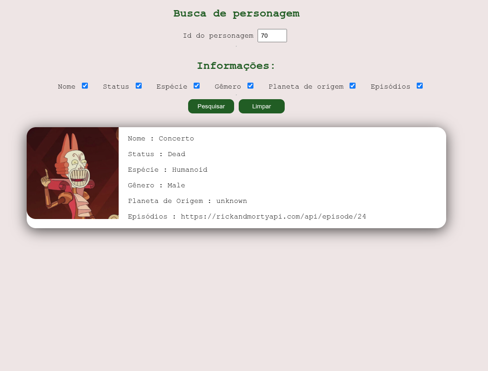

# 🔍 Projeto: Buscador de Personagens - Rick and Morty API

Este é um projeto simples desenvolvido com **HTML, CSS e JavaScript**, que consome dinamicamente a [API pública do Rick and Morty](https://rickandmortyapi.com/) para exibir informações de personagens com base no ID informado pelo usuário.

## 🎯 Objetivo

O principal objetivo deste projeto é **praticar o consumo de APIs** utilizando JavaScript puro e aplicar conceitos como:

- Requisições assíncronas com `fetch` e `async/await`;
- Manipulação do DOM;
- Condicionais baseadas na seleção do usuário (checkboxes);
- Apresentação dinâmica de dados em tela;

## 📸 Captura de tela

## 🧠 Funcionalidades

- Entrada de um ID de personagem;
- Seletor de informações via checkboxes (Nome, Status, Espécie, Gênero, Planeta de origem e Episódios);
- Botão de **pesquisar** que faz a requisição e renderiza os dados;
- Botão de **limpar** que reseta os resultados;
- Exibição da imagem do personagem;

